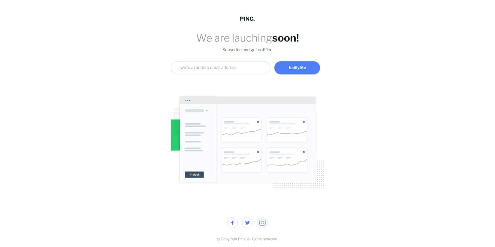

# Frontend Mentor - Ping coming soon page solution

This is a solution to the [Ping coming soon page challenge on Frontend Mentor](https://www.frontendmentor.io/challenges/ping-single-column-coming-soon-page-5cadd051fec04111f7b848da). Frontend Mentor challenges help you improve your coding skills by building realistic projects.

## Table of contents

- [Overview](#overview)
  - [The challenge](#the-challenge)
  - [Screenshot](#screenshot)
  - [Links](#links)
- [My process](#my-process)
  - [Built with](#built-with)
  - [What I learned](#what-i-learned)
  - [Continued development](#continued-development)
  - [Useful resources](#useful-resources)
- [Author](#author)
- [Acknowledgments](#acknowledgments)

**Note: Delete this note and update the table of contents based on what sections you keep.**

## Overview

### The challenge

Users should be able to:

- View the optimal layout for the site depending on their device's screen size
- See hover states for all interactive elements on the page
- Submit their email address using an `input` field
- Receive an error message when the `form` is submitted if:
  - The `input` field is empty. The message for this error should say _"Whoops! It looks like you forgot to add your email"_
  - The email address is not formatted correctly (i.e. a correct email address should have this structure: `name@host.tld`). The message for this error should say _"Please provide a valid email address"_

### Screenshot

### Links

- Solution URL: [Add solution URL here](https://your-solution-url.com)
- Live Site URL: [Add live site URL here](https://your-live-site-url.com)

## My process

### Built with

- Semantic HTML5 markup
- CSS custom properties
- Flexbox
- CSS Grid
- Mobile-first workflow
- [React](https://reactjs.org/) - JS library
- [Tailwind CSS](https://tailwindcss.com/) - For styles
- [React Icons](https://react-icons.github.io/react-icons/) For icons
- [React Hook Forms](https://react-hook-form.com/) For Form management
- [Framer Motion](https://www.framer.com/motion/) For Animations
- [How to implement React Hook Forms](https://www.freecodecamp.org/news/how-to-validate-forms-in-react/)

### What I learned

- How to use React hook Form
- A taste of Framer motion

### Continued development

I've still a lot to learn in react and the other tools is used working in this project, but It have give an overal view on how to manage Form Validation.

### Useful resources

- [How to manage Form validation with React Hook Form](https://www.freecodecamp.org/news/how-to-validate-forms-in-react/) - This helped me a ton, it made my work process a lot easier and also maybe for futer projects.

## Author

- Frontend Mentor - [@EDGARTOYIN](https://www.frontendmentor.io/profile/EDGARTOYIN)

## Acknowledgments

Thank you Yazdun Fadali, your post help me and teach me a lot.
